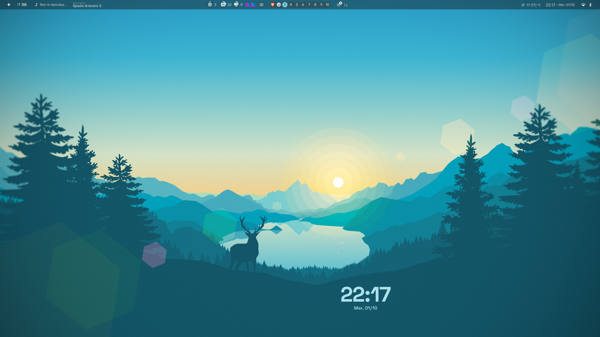

# Hyprland-dotfiles

Personal Hyprland desktop config — Quickshell bar, Illogical-Impulse theming, and all supporting tools.

## What's included

| Config | Purpose |
|--------|---------|
| `hypr` | Hyprland compositor, keybinds, rules, shaders, hyprlock, hypridle |
| `quickshell` | Status bar and desktop widgets (Caelestia + II themes) |
| `illogical-impulse` | Illogical-Impulse theme engine |
| `rofi` | App launcher |
| `kitty` | Terminal emulator |
| `foot` | Terminal emulator (fallback) |
| `dunst` | Notification daemon |
| `wlogout` | Logout/power screen |
| `swaylock` | Screen locker |
| `swaync` | Notification centre |
| `gtk-3.0` / `gtk-4.0` | GTK theming |
| `Kvantum` | Qt theming |
| `nwg-look` | GTK theme switcher settings |
| `fish` | Fish shell config |

## Screenshots



## Install (repo → system)

Copies dotfiles from this repo into `~/.config/`. Existing configs are **backed up** before being replaced.

```bash
git clone https://github.com/MaxGiuP/Hyprland-dotfiles
cd Hyprland-dotfiles
bash install.sh
```

Run with `-n` first to preview what will change without touching anything:

```bash
bash install.sh -n
```

Log out and back into Hyprland after installing.

## Update (system → repo)

Captures your current live configs back into the repo so you can commit them:

```bash
bash update.sh
```

This will show a diff of what changed and ask before overwriting each config in the repo. Then it offers to commit and push.

Run with `-n` for a dry-run preview:

```bash
bash update.sh -n
```

## Script flags

| Flag | Effect |
|------|--------|
| `-y` | Skip all confirmation prompts |
| `-n` | Dry-run — show changes, touch nothing |
